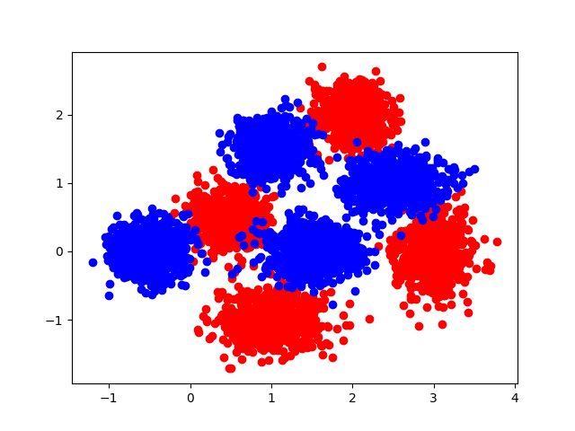

# Report: EM implementation for GMM
lxy9843@sjtu.edu.cn 2018-8-13

## coursework requirement

- Implement training and testing algorithms for GMM. Programmes must be written in C/C++ or **python** or Matlab.

- Use train.txt for training and check the result on dev.txt. The complexity of GMM and initialisation of GMM will be decided by you.

- Once the final GMM configuration is fixed, you will perform classification on test.txt and save the result in the same format as dev.txt.

- Final submission should include:
    - a. Detailed report including:
        - i. Initialisation of GMM
        - ii. GMM parameter tuning process (likelihood change, result on dev.txt etc.)
        - iii. Analysis and discussion
    - b. Classification result: test.txt with label
    - c. Source code or tools which can be compiled and/or run under windows or linux machine (Ubuntu)

## Initialisation of GMM

- **K**: *number of GM*
    - hyper parameter
- **$\mu_i$**: *expected value*
    - ```np.random.random((K, D)) * np.mean(x, axis=0)```
    - D: dim
    - x: input data
- **$\Sigma_i$**: *covariance*
    - ```[np.mat(np.eye(D)) for _ in range(K)]```
    - D: dim
- **$\pi_i$**: *mixing probability*
    - ```temp = np.random.random(K)```
    - ```pi = temp / np.sum(temp)```

## GMM parameter tuning process

- First, illustrate the dataset



- It's clear that both red and blue clusters are generated by 4 GM (K=4)

- Run tests on dev.txt to varify that. (acc > 95%, positive)

## Analysis and discussion

- Why acc != 100% in test data
    - Because some points are too far from it's origin GM's center, and too near to another's.

## Directory structure

- results
    - classification results
- data
    - kaggle competition data
- data.py
    - script to handle csv format
- GMM.py
    - GMM model, trained when initialized
- train.py
    - script using model to finish kaggle task
- run.sh
    - python train.py [arg="train"/"test"]
- submit.sh
    - submit result($1) to kaggle, comment($2)
